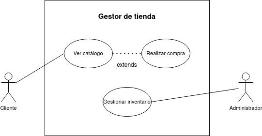

# Diagrama de casos de uso - Gestión de tienda

## Especificación de los actores

|  Actor | Cliente |
|---|---|
| Descripción  | Persona quien verá el catálogo de productos y realizará compras. |
| Relaciones | No hay relación directa con el administrador. |
| Referencias | **Ver catálogo** y **Realizar compra** |   
| Autor  | Jesús Daniel Lugo López |
|Fecha | 16 de Enero, 2024 |

|  Actor | Administrador |
|---|---|
| Descripción  | Quien gestiona el inventario de la tienda. |
| Relaciones | No hay relación directa con el cliente.  |
| Referencias | **Gestionar inventario** |   
| Autor  | Jesús Daniel Lugo López |
|Fecha | 16 de Enero, 2024 |

## Especificación de los casos de uso

  |  Caso de Uso	CU | Ver catálogo  |
  |---|---|
  | Actor  |  Cliente |
  | Descripción | El cliente podrá ver el catálogo de productos disponibles en la tienda. |
  | Flujo básico | Cliente introduce el nombre del producto que busca -> el sistema devuelve su disponibilidad -> le presentará la opción de solicitarlo -> en caso de que sí quiera pedirlo, se le enviará la solicitud al administrador un registro. |
  | Pre-condiciones | Nombre del producto  |  
  | Post-condiciones  | Devolver un mensaje que indique la disponibilidad del producto y la opción de compra  |  
  |  Requerimientos | N/A |
  | Autor  | Jesús Daniel Lugo López |
  |Fecha | 16 de Enero, 2024 |
  
  |  Caso de Uso	CU | Realizar compra  |
  |---|---|
  | Actor  |  Cliente |
  | Descripción | Comprar el producto buscado en el catálogo.  |
  | Flujo básico | Cliente solicita el producto -> Lo paga con el método configurado -> Recibe el producto via correo o es llamado a buscarlo presencialmente.|
  | Pre-condiciones | Que el producto esté disponible, que haya dinero suficiente,  |  
  | Post-condiciones  | El cliente tendrá el libro por un tiempo determinado.  |  
  |  Requerimientos | El libro buscado  |
  | Autor  | Jesús Daniel Lugo López |
  |Fecha | 16 de Enero, 2024 |

  |  Caso de Uso	CU | Gestionar inventario  |
  |---|---|
  | Actor  |  cliente |
  | Descripción | El cliente, antes, durante o después del fin de tiempo determinado, devuelve el libro a la biblioteca.  |
  | Flujo básico | El cliente llega a la biblioteca -> devuelve el libro a manos de bibliotecario o se deja en un sistema electrónico de recogida. |
  | Pre-condiciones | El cliente debe tener el libro.  |  
  | Post-condiciones  | La biblioteca volverá a tener en su inventario el libro devuelto. |  
  |  Requerimientos | El libro a devolver  |
  | Autor  | Jesús Daniel Lugo López |
  |Fecha | 16 de Enero, 2024 |