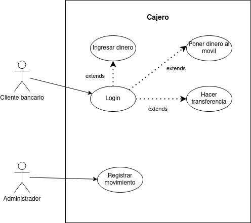

# Diagrama de casos de uso - Cajero ATM

## Índice
- [Especificación de actores](#especificación-de-actores)
    - [Cliente bancario](#actor-cliente-bancario)
    - [Administrador](#actor-administrador)
- [Especificación de casos de uso](#especificación-de-actores)
    - [Ingresar dinero](#ingresar-dinero)
    - [Hacer transferencia](#hacer-transferencia)
    - [Poner dinero al movil](#poner-dinero-al-movil)
    - [Login](#login)
    - [Registrar movimiento](#registrar-movimiento)

## Especificación de actores

### Actor 'Cliente bancario'

|  Actor | Cliente bancario |
|---|---|
| Descripción  | Aquella persona que contrata un producto o servicio con una entidad financiera.  |
| Relaciones | En el diagrama de casos de uso actual no se encuentra ninguna relación directa con otro actor. |
| Referencias | CU-01, CU-02, CU-03, CU-04 |   
| Autor  | Jesús Daniel Lugo López |
|Fecha | 25 de Enero, 2024 |

### Actor 'Administrador'

|  Actor | Administrador |
|---|---|
| Descripción  | Persona que registra las entradas y salidas monetarias del sistema del cajero automático.  |
| Relaciones | En el diagrama de casos de uso actual no se encuentra ninguna relación directa con otro actor. |
| Referencias | CU-05 |   
| Autor  | Jesús Daniel Lugo López |
|Fecha | 25 de Enero, 2024 | 

## Especificación de casos de uso

### Ingresar dinero

  |  Caso de Uso	CU-01 | Ingresar dinero  |
  |---|---|
  | Actor  |  Cliente bancario |
  | Descripción | El cliente puede depositar dinero en su cuenta bancaria a través del cajero automático. |
  | Flujo básico | El cliente inicia sesión -> Inserta el dinero en su cuenta bancaria a través del sistema si la cantidad está disponible. |
  | Pre-condiciones | CU-04 'Login'  |  
  | Post-condiciones  | Indicar las opciones de hacer transferencias, poner dinero al movil o retirar dinero.  |  
  |  Requerimientos | Dinero en efectivo |
  | Autor  | Jesús Daniel Lugo López |
  |Fecha | 25 de Enero, 2024 |

### Hacer transferencia

  |  Caso de Uso	CU-02 | Hacer transferencia  |
  |---|---|
  | Actor  |  Cliente bancario |
  | Descripción | _Descripción del caso de uso_  |
  | Flujo básico | _Descripción paso a paso de la ejecución. (1->2->3.)_ |
  | Pre-condiciones | _Que debe ocurrir con anterioridad_  |  
  | Post-condiciones  | _Que debe ocurrir con posterioridad_  |  
  |  Requerimientos | _Que debe de exister para que el caso de uso se ejecute. Ej: Tarjeta de crédito_  |
  | Autor  | Jesús Daniel Lugo López |
  |Fecha | 25 de Enero, 2024 |

### Poner dinero al movil

  |  Caso de Uso	CU-03 | Poner dinero al movil  |
  |---|---|
  | Actor  |  Cliente bancario |
  | Descripción | _Descripción del caso de uso_  |
  | Flujo básico | _Descripción paso a paso de la ejecución. (1->2->3.)_ |
  | Pre-condiciones | _Que debe ocurrir con anterioridad_  |  
  | Post-condiciones  | _Que debe ocurrir con posterioridad_  |  
  |  Requerimientos | _Que debe de exister para que el caso de uso se ejecute. Ej: Tarjeta de crédito_  |
  | Autor  | Jesús Daniel Lugo López |
  |Fecha | 25 de Enero, 2024 |

### Login

  |  Caso de Uso	CU-04 | Login  |
  |---|---|
  | Actor  |  Cliente bancario |
  | Descripción | _Descripción del caso de uso_  |
  | Flujo básico | _Descripción paso a paso de la ejecución. (1->2->3.)_ |
  | Pre-condiciones | _Que debe ocurrir con anterioridad_  |  
  | Post-condiciones  | _Que debe ocurrir con posterioridad_  |  
  |  Requerimientos | _Que debe de exister para que el caso de uso se ejecute. Ej: Tarjeta de crédito_  |
  | Autor  | Jesús Daniel Lugo López |
  |Fecha | 25 de Enero, 2024 |

### Registrar movimiento

  |  Caso de Uso	CU-05 | Registrar movimiento  |
  |---|---|
  | Actor  |  Administrador |
  | Descripción | _Descripción del caso de uso_  |
  | Flujo básico | _Descripción paso a paso de la ejecución. (1->2->3.)_ |
  | Pre-condiciones | _Que debe ocurrir con anterioridad_  |  
  | Post-condiciones  | _Que debe ocurrir con posterioridad_  |  
  |  Requerimientos | _Que debe de exister para que el caso de uso se ejecute. Ej: Tarjeta de crédito_  |
  | Autor  | Jesús Daniel Lugo López |
  |Fecha | 25 de Enero, 2024 |

